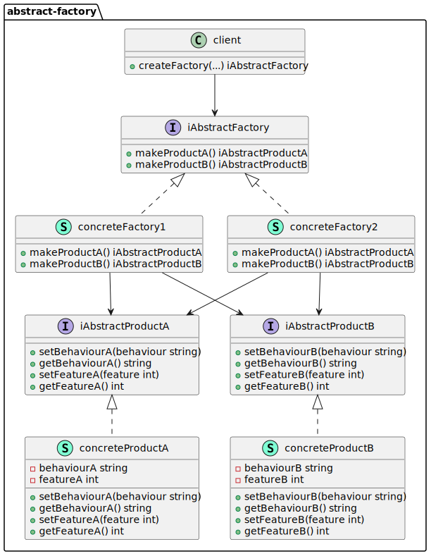

# go-dsgn-pttrn-abstract-factory

> A Go implementation of the Abstract Factory design pattern.

The Abstract Factory is a creational design pattern that provides a way to encapsulate the creation of a set of related objects without having to specify the exact form of these related objects. 

&nbsp;

  

